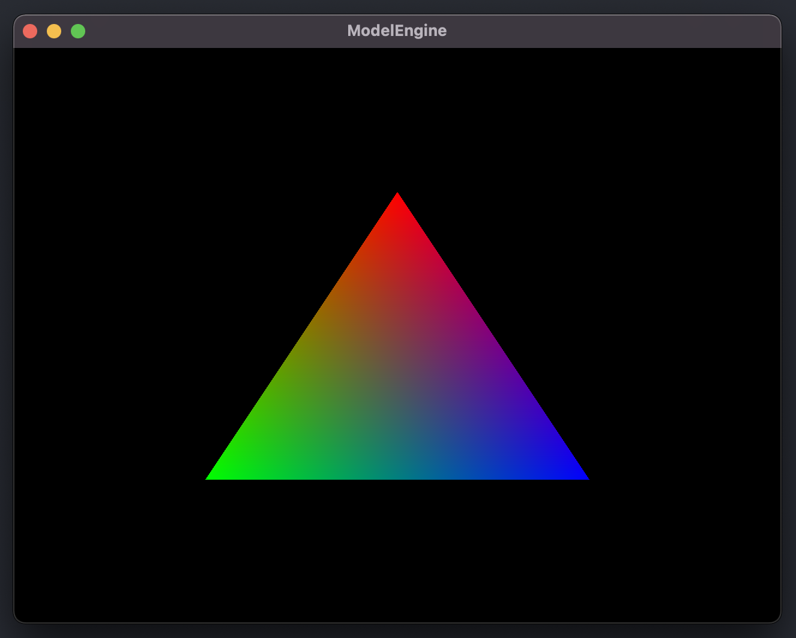

# ModelEngine

Basic OpenGL Engine for loading up models

## Initial Render Test

## M1 Mac Setup

1. Download, build, install glfw3 using [Guide](http://carette.xyz/posts/opengl_and_cpp_on_m1_mac/)
2. Make a build directory in the top level folder
3. Run `cmake ..` in build directory
4. Run `make`
5. Voila!
